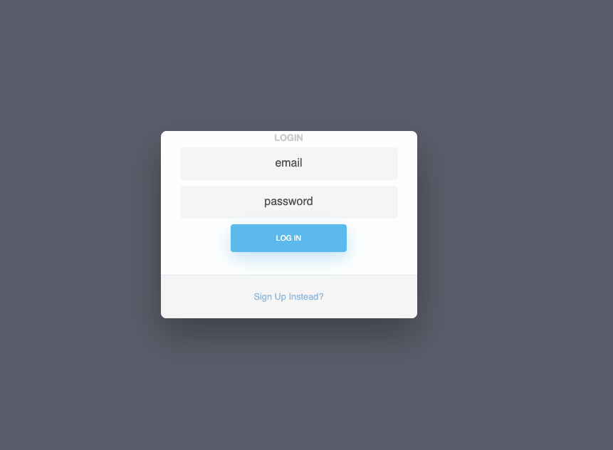
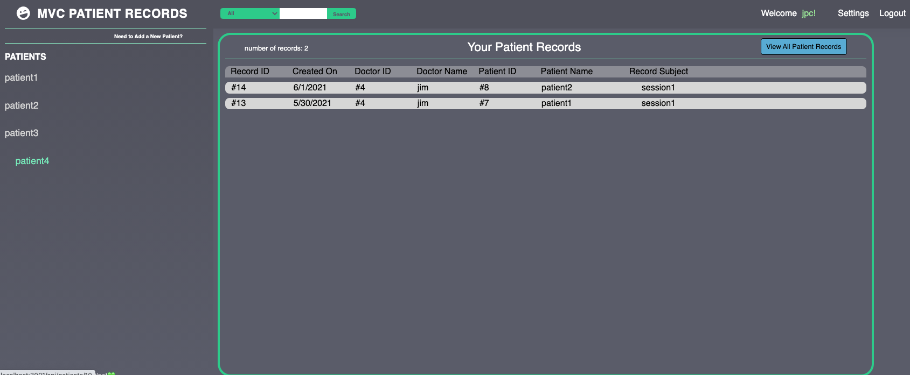
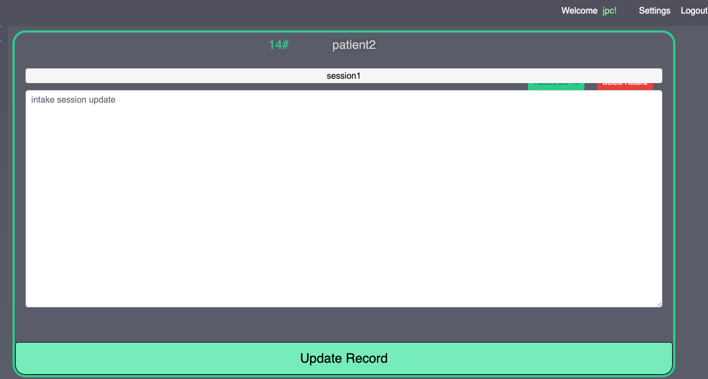
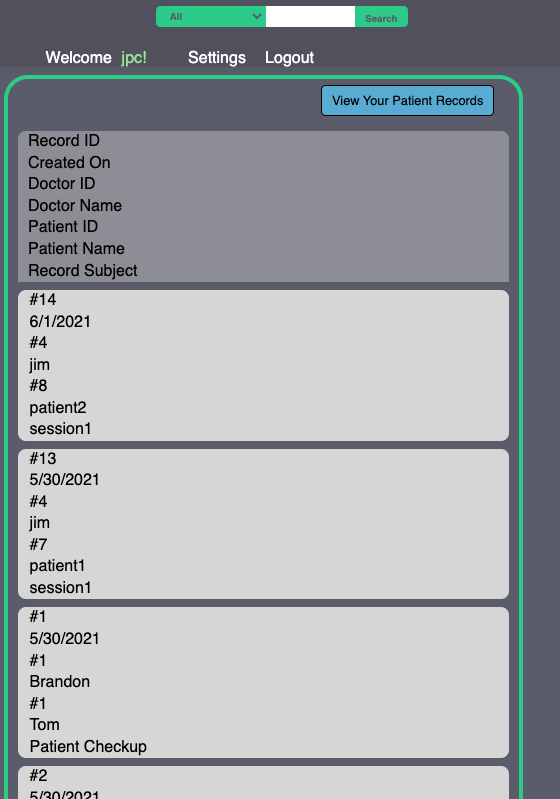

# MVC Patient Records 

## Table of Contents
* [Description](#description)
* [Live Application](#live-application)
* [Use Case](#use-case)
* [User Workflow](#user-workflow)
* [Installation](#installation)
* [License](#license)
* [Contributors](#contributors)
* [Questions](#questions)
* [Screenshots](#screenshots)

## Description
Full-stack application following MVC paradigm for creating, updating, sorting and deleting patient records. The UI uses tags for sorting by different patients associated with the specific user for quicker access to relevant information. The application also leverages a search bar for quick searches of existing records.

### Languages Used
- JavaScript (Node.js)
- SQL (mySQL)
- HTML (handlebars.js)
- CSS

### Node Libraries Used
- [mySQL](https://www.npmjs.com/package/mysql)
- [Sequelize](https://www.npmjs.com/package/sequelize)
- [Express](https://www.npmjs.com/package/express)
- [Express Handlebars](https://www.npmjs.com/package/express-handlebars)
- [Bcrypt](https://www.npmjs.com/package/bcrypt)
- [Dotenv](https://www.npmjs.com/package/dotenv)

See [package.json](./package.json) for full list of dependencies.

### Additional Libraries
- [Bootstrap](https://getbootstrap.com/)
- [Google Fonts](https://fonts.google.com/)
- [Font Awesome](https://fontawesome.com/)

## Live Application
View the app deployment on Heroku: https://patient-records-tracker.herokuapp.com

## Use Case
```md
AS A doctor at a hospital
I WANT a back end and front end application that I can record my patient records
SO THAT I can always look back at patients records when they visit
```

## User Workflow
```md
GIVEN a functioning patient record database
WHEN I open the home page
THEN I am presented with records of recent notes from patients
WHEN I click to create a new record
THEN I am presented with a blank area to type
WHEN I click to save the new record
THEN the record is stored under that patient name
WHEN I click the edit button on a record
THEN I am able to edit the information on the record
WHEN I click on the delete button for a record
THEN that record is removed from the database
WHEN I search for a patient's name
THEN I am presented with that patient's records
```
## Installation
To run this application on your local machine, Node.js is _required_. Once Node.js is installed, clone the repository to your local development environment:
```
git clone https://github.com/Captain63/patient-records-tracker.git
```

Run ```npm install``` to install all dependencies. Then run ```mysql -u root < db/schema.sql``` to create the database. Then run ```npm run seeds``` to seed the database with the sample data from the seeds file. Then create a .env file using [.env.EXAMPLE](./.env.EXAMPLE) for reference. To use the application locally, run ```npm start``` in your CLI, and then open http://localhost:3001 in your preferred browser.

## License
Permission is hereby granted, free of charge, to any person obtaining a copy of this Software and associated documentation files (the "Software"), to deal in the Software without  restriction, including without limitation the rights to use, copy, modify, merge, publish distribute, sublicense, and/or sell copies of the Software, and to permit persons to whom the Software is furnished to do so, subject to the following conditions.

[View the full license](./LICENSE)

## Contributors
- Rachel Handschuh GitHub: [@rhandschuh](https://github.com/rhandschuh)
- James Corcoran GitHub: [@jcorcorangithub](https://github.com/jcorcorangithub)
- Stephen Roddewig GitHub: [@Captain63](https://github.com/Captain63)
- Brandon Ford GitHub: [@brandonfordd](https://github.com/brandonfordd)


## Questions
If you have any questions, [open an issue on GitHub](https://github.com/Captain63/patient-records-tracker/issues) and a contributor will be in touch!

## Screenshots




